# Laravel Mermaid ERD

[](https://packagist.org/packages/bambamboole/laravel-mermaid-erd)
[](https://github.com/bambamboole/laravel-mermaid-erd/actions?query=workflow%3Arun-tests+branch%3Amain)
[](https://github.com/bambamboole/laravel-mermaid-erd/actions?query=workflow%3A"Fix+PHP+code+style+issues"+branch%3Amain)
[](https://packagist.org/packages/bambamboole/laravel-mermaid-erd)

Generate Entity-Relationship Diagrams (ERDs) from your Laravel database schema using [Mermaid.js](https://mermaid.js.org/). Visualize tables, columns, and foreign key relationships with a single Artisan command.

## Example

Generated from this package's own test schema:

```mermaid
---
title: 26 tables · 169 columns
---
erDiagram
    addresses["addresses (9)"] {
        integer id PK
        integer customer_id FK
        varchar type "default: 'shipping'"
        varchar street
        varchar city
        varchar zip
        varchar country
        datetime created_at "nullable"
        datetime updated_at "nullable"
    }
    ai_messages["ai_messages (6) · AiMessage"] {
        integer id PK
        integer user_id
        text prompt
        text response "nullable"
        datetime created_at "nullable"
        datetime updated_at "nullable"
    }
    attachments["attachments (7) · Attachment"] {
        integer id PK
        varchar attachable_type "polymorphic"
        integer attachable_id "polymorphic"
        varchar path
        varchar mime_type "nullable"
        datetime created_at "nullable"
        datetime updated_at "nullable"
    }
    audit_logs["audit_logs (6)"] {
        integer id PK
        integer user_id
        varchar action
        text payload "nullable"
        datetime created_at "nullable"
        datetime updated_at "nullable"
    }
    categories["categories (5)"] {
        integer id PK
        varchar name
        integer parent_id FK "nullable"
        datetime created_at "nullable"
        datetime updated_at "nullable"
    }
    comments["comments (6)"] {
        integer id PK
        integer post_id FK
        integer user_id FK
        text body
        datetime created_at "nullable"
        datetime updated_at "nullable"
    }
    coupon_order["coupon_order (5)"] {
        integer id PK
        integer coupon_id FK
        integer order_id FK
        datetime created_at "nullable"
        datetime updated_at "nullable"
    }
    coupons["coupons (6)"] {
        integer id PK
        varchar code UK
        integer discount
        datetime valid_until "nullable"
        datetime created_at "nullable"
        datetime updated_at "nullable"
    }
    customers["customers (7) · Customer"] {
        integer id PK
        integer user_id FK "nullable"
        varchar name "accessor"
        varchar email UK
        varchar phone "nullable"
        datetime created_at "nullable"
        datetime updated_at "nullable"
    }
    invoices["invoices (6)"] {
        integer id PK
        integer order_id FK, UK
        varchar number UK
        datetime issued_at "nullable"
        datetime created_at "nullable"
        datetime updated_at "nullable"
    }
    order_items["order_items (7)"] {
        integer id PK
        integer order_id FK
        integer product_variant_id FK
        integer quantity
        integer unit_price
        datetime created_at "nullable"
        datetime updated_at "nullable"
    }
    orders["orders (9) · Order"] {
        integer id PK
        integer customer_id FK
        varchar number UK
        varchar status "cast: OrderStatus, default: 'pending'"
        integer total
        datetime placed_at "cast: immutable_datetime, nullable"
        datetime deleted_at "soft-delete, cast: datetime, nullable"
        datetime created_at "nullable"
        datetime updated_at "nullable"
    }
    payments["payments (7)"] {
        integer id PK
        integer order_id FK
        varchar method
        integer amount
        datetime paid_at "nullable"
        datetime created_at "nullable"
        datetime updated_at "nullable"
    }
    post_tag["post_tag (5)"] {
        integer id PK
        integer post_id FK
        integer tag_id FK
        datetime created_at "nullable"
        datetime updated_at "nullable"
    }
    posts["posts (6) · Post"] {
        integer id PK
        integer user_id FK
        varchar title
        text body
        datetime created_at "nullable"
        datetime updated_at "nullable"
    }
    product_variants["product_variants (7)"] {
        integer id PK
        integer product_id FK
        varchar sku UK
        varchar options "nullable"
        integer price "nullable"
        datetime created_at "nullable"
        datetime updated_at "nullable"
    }
    products["products (10)"] {
        integer id PK
        integer supplier_id FK
        integer category_id FK "nullable"
        varchar name
        varchar sku UK
        integer price
        text description "nullable"
        datetime deleted_at "soft-delete, nullable"
        datetime created_at "nullable"
        datetime updated_at "nullable"
    }
    reviews["reviews (8) · Review"] {
        integer id PK
        varchar reviewable_type "polymorphic"
        integer reviewable_id "polymorphic"
        integer user_id FK
        text body
        integer rating
        datetime created_at "nullable"
        datetime updated_at "nullable"
    }
    shipment_items["shipment_items (6)"] {
        integer id PK
        integer shipment_id FK
        integer order_item_id FK
        integer quantity
        datetime created_at "nullable"
        datetime updated_at "nullable"
    }
    shipments["shipments (7)"] {
        integer id PK
        integer order_id FK
        integer warehouse_id FK
        varchar tracking_number "nullable"
        datetime shipped_at "nullable"
        datetime created_at "nullable"
        datetime updated_at "nullable"
    }
    stocks["stocks (6)"] {
        integer id PK
        integer warehouse_id FK
        integer product_variant_id FK
        integer quantity "default: '0'"
        datetime created_at "nullable"
        datetime updated_at "nullable"
    }
    suppliers["suppliers (6)"] {
        integer id PK
        varchar name
        varchar email UK
        varchar phone "nullable"
        datetime created_at "nullable"
        datetime updated_at "nullable"
    }
    tags["tags (5)"] {
        integer id PK
        varchar name
        varchar slug UK
        datetime created_at "nullable"
        datetime updated_at "nullable"
    }
    users["users (5) · User"] {
        integer id PK
        varchar name
        varchar email UK
        datetime created_at "nullable"
        datetime updated_at "nullable"
    }
    videos["videos (6) · Video"] {
        integer id PK
        varchar title
        varchar url
        datetime deleted_at "soft-delete, cast: datetime, nullable"
        datetime created_at "nullable"
        datetime updated_at "nullable"
    }
    warehouses["warehouses (6)"] {
        integer id PK
        varchar name
        varchar code UK
        varchar address "nullable"
        datetime created_at "nullable"
        datetime updated_at "nullable"
    }
    customers ||--o{ addresses : "has many via customer_id, cascade delete"
    users ||--o{ ai_messages : "hasMany via user_id, no index"
    users ||--o{ audit_logs : "guessed has many via user_id, no index"
    categories |o--o{ categories : "self-ref via parent_id, set null delete"
    users ||--o{ comments : "has many via user_id, cascade delete"
    posts ||--o{ comments : "has many via post_id, cascade delete"
    orders ||--o{ coupon_order : "pivot, has many via order_id, cascade delete"
    coupons ||--o{ coupon_order : "pivot, has many via coupon_id, cascade delete"
    users |o--o{ customers : "has many via user_id, set null delete"
    orders ||--|| invoices : "has one via order_id, cascade delete"
    product_variants ||--o{ order_items : "has many via product_variant_id"
    orders ||--o{ order_items : "has many via order_id, cascade delete"
    customers ||--o{ orders : "has many via customer_id, cascade delete"
    orders ||--o{ payments : "has many via order_id, cascade delete"
    tags ||--o{ post_tag : "pivot, has many via tag_id, cascade delete"
    posts ||--o{ post_tag : "pivot, has many via post_id, cascade delete"
    users ||--o{ posts : "has many via user_id, cascade delete"
    products ||--o{ product_variants : "has many via product_id, cascade delete"
    categories |o--o{ products : "has many via category_id, set null delete"
    suppliers ||--o{ products : "has many via supplier_id, cascade delete"
    users ||--o{ reviews : "has many via user_id, cascade delete"
    order_items ||--o{ shipment_items : "has many via order_item_id, cascade delete"
    shipments ||--o{ shipment_items : "has many via shipment_id, cascade delete"
    warehouses ||--o{ shipments : "has many via warehouse_id"
    orders ||--o{ shipments : "has many via order_id, cascade delete"
    product_variants ||--o{ stocks : "has many via product_variant_id, cascade delete"
    warehouses ||--o{ stocks : "has many via warehouse_id, cascade delete"
    posts ||--o{ reviews : "morphMany via reviewable"
    videos ||--o{ reviews : "morphMany via reviewable"
    posts ||--o{ attachments : "morphMany via attachable"
    videos ||--o{ attachments : "morphMany via attachable"
```

<!-- mermaid-erd-start -->

<!-- mermaid-erd-end -->

## Installation

Requires PHP 8.3+ and Laravel 12 or 13.

```bash
composer require bambamboole/laravel-mermaid-erd
```

Optionally publish the config file to customize which tables are ignored:

```bash
php artisan vendor:publish --tag="mermaid-erd-config"
```

## Usage

```bash
php artisan generate:mermaid-erd
```

When run without options, the command will interactively ask how you want to output the diagram.

### Output modes

#### Print to stdout

```bash
php artisan generate:mermaid-erd --output=stdout
```

Prints the Mermaid ERD diagram directly to the console.

#### Write to a file

```bash
php artisan generate:mermaid-erd --output=file --path=README.md
```

Writes the diagram to the specified file (defaults to `README.md`). The file output uses `<!-- mermaid-erd-start -->` / `<!-- mermaid-erd-end -->` comment tags:

- **File has tags**: replaces content between the tags
- **File exists without tags**: appends an `## ERD` section with the diagram
- **File doesn't exist**: creates it with the diagram
- **Path ends in `.mmd`**: writes the plain Mermaid source without any markdown wrapper

Add these tags where you want the diagram to appear:

```markdown
<!-- mermaid-erd-start -->
<!-- mermaid-erd-end -->
```

### Options

#### `--connection`

Use a specific database connection instead of the default:

```bash
php artisan generate:mermaid-erd --output=stdout --connection=mysql
```

#### `--tables`

Only include specific tables (comma-separated):

```bash
php artisan generate:mermaid-erd --output=stdout --tables=users,posts,comments
```

#### `--exclude-tables`

Exclude specific tables, on top of the configured ignore list:

```bash
php artisan generate:mermaid-erd --output=stdout --exclude-tables=audit_logs,ai_messages
```

### Configuration

The config file allows you to ignore specific tables:

```php
return [
    'schema' => null,

    'ignore_tables' => [
        'migrations',
        'failed_jobs',
        'sessions',
        // ...
    ],
];
```

By default, MySQL connections are scoped to the active database name so tables
from other visible databases are not included in the diagram. Set `schema` if you
want to inspect a specific schema/database explicitly.

### Model metadata

When enabled (the default), the package scans your Eloquent models and enriches the diagram with what only the code knows:

- the owning model class in each table header (`orders (9) · Order`)
- casts, accessors and mutators as column annotations (`varchar status "cast: OrderStatus"`)
- polymorphic relations, auto-discovered from `morphOne` / `morphMany` / `morphToMany` methods — no manual `polymorphic_relationships` config needed for them
- `hasMany` / `hasOne` / `belongsTo` relations for columns without a foreign key constraint — rendered with the declaring method (`hasMany via user_id`) and replacing the name-based guess. Precedence: foreign key constraint > model relation > guess.

Only relation methods with an **explicit return type** are invoked (and each call is failure-isolated), so the scan never executes arbitrary model code. Configure it via:

```php
'models' => [
    'enabled' => true,
    'paths' => null, // null defaults to [app_path()]
],
```

The `polymorphic_relationships` config still works and is merged on top — use it for morphs the scan cannot see (untyped relation methods, external packages).

### Smart relationship detection

The generator automatically detects pivot tables (tables with exactly 2 foreign keys and only `id`/timestamp columns) and renders them as many-to-many relationships instead of separate entities. Foreign key columns with unique indexes are rendered as one-to-one relationships.

## Web view

The package also ships a web view that renders the diagram in the browser using Mermaid.js. It is enabled by default at `/mermaid-erd` and configurable via the `web` section of the config file.

The view has a search box that filters the diagram live: type a table or column name and only matching tables plus their directly connected neighbors stay visible. Pivot tables are treated as pass-throughs — a many-to-many counts as one relation, so both of its sides stay visible.

Append `?raw=1` to the route to get the plain Mermaid source as `text/plain` — handy for scripts or pasting into [mermaid.live](https://mermaid.live). The query is kept in the URL (`?q=orders`), so filtered views are shareable, and "Copy Mermaid" / "Download SVG" export exactly what is on screen.

```php
'web' => [
    'enabled' => true,
    'route' => '/mermaid-erd',
    'middleware' => ['web'],

    // Cache the generated diagram (useful for large schemas)
    'cache' => [
        'enabled' => false,
        'ttl' => 3600,
    ],

    // Passed straight to mermaid.initialize()
    'mermaid' => [
        'theme' => 'default',
        'securityLevel' => 'loose',
        'logLevel' => 'error',
        'er' => [
            'useMaxWidth' => false,
        ],
    ],
],
```

The view exposes your database structure, so protect it in production — add auth middleware to `web.middleware` or set `web.enabled` to `false`.

## Testing

```bash
composer test
```

## Changelog

Please see [CHANGELOG](CHANGELOG.md) for more information on what has changed recently.

## Credits

- [bambamboole](https://github.com/bambamboole)
- [All Contributors](../../contributors)

## License

The MIT License (MIT). Please see [License File](LICENSE.md) for more information.
