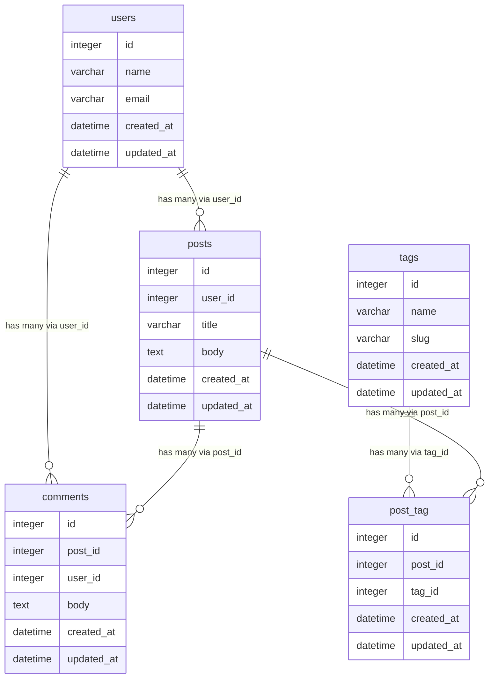

```mermaid
erDiagram
    comments {
        integer id
        integer post_id
        integer user_id
        text body
        datetime created_at
        datetime updated_at
    }
    post_tag {
        integer id
        integer post_id
        integer tag_id
        datetime created_at
        datetime updated_at
    }
    posts {
        integer id
        integer user_id
        varchar title
        text body
        datetime created_at
        datetime updated_at
    }
    tags {
        integer id
        varchar name
        varchar slug
        datetime created_at
        datetime updated_at
    }
    users {
        integer id
        varchar name
        varchar email
        datetime created_at
        datetime updated_at
    }
    users ||--o{ comments : "has many via user_id"
    posts ||--o{ comments : "has many via post_id"
    tags ||--o{ post_tag : "has many via tag_id"
    posts ||--o{ post_tag : "has many via post_id"
    users ||--o{ posts : "has many via user_id"
```
