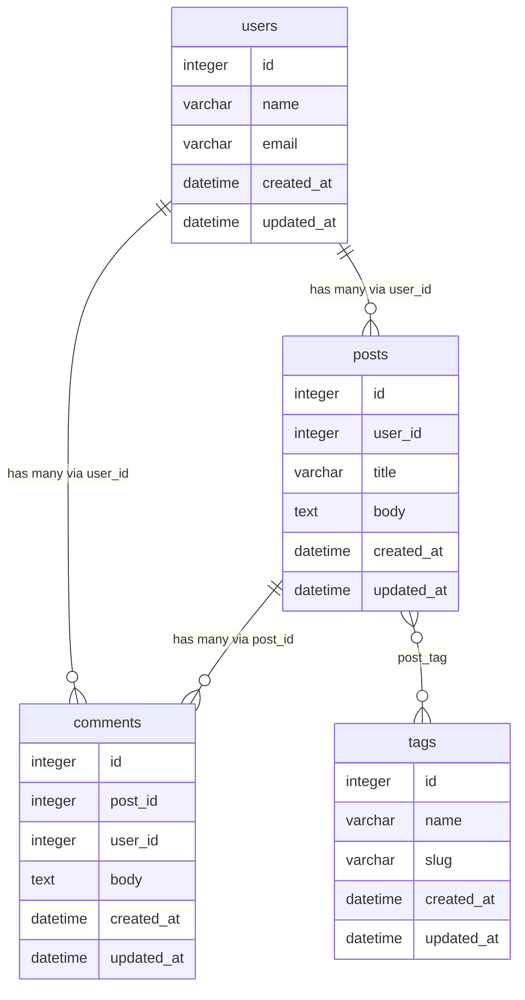

## ERD

<!-- mermaid-erd-start -->

```mermaid
erDiagram
    comments {
        integer id
        integer post_id
        integer user_id
        text body
        datetime created_at
        datetime updated_at
    }
    posts {
        integer id
        integer user_id
        varchar title
        text body
        datetime created_at
        datetime updated_at
    }
    tags {
        integer id
        varchar name
        varchar slug
        datetime created_at
        datetime updated_at
    }
    users {
        integer id
        varchar name
        varchar email
        datetime created_at
        datetime updated_at
    }
    users ||--o{ comments : "has many via user_id"
    posts ||--o{ comments : "has many via post_id"
    users ||--o{ posts : "has many via user_id"
    posts }o--o{ tags : "post_tag"
```
<!-- mermaid-erd-end -->
